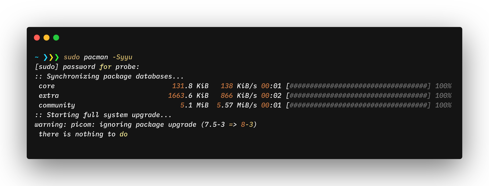

# probe_zsh

A zsh theme with git prompt highlighters for convenient syntaxing and representation.

## Requirements

1. zsh
2. git

## Images




## Installation

Clone this repository into a specific folder such as ``` ~/.zsh_themes/ ``` using the command
```
git clone https://github.com/probe2k/probe_zsh.git ~/.zsh_themes/
```
Edit your ``` ~/.zshrc ``` to source this folder and setup the theme
> ZSH_THEME="~/.zsh_themes/probe"

# Issues

All the bugs encountered so far have been resolved already. Feel free to PR with improvements and fixes.
